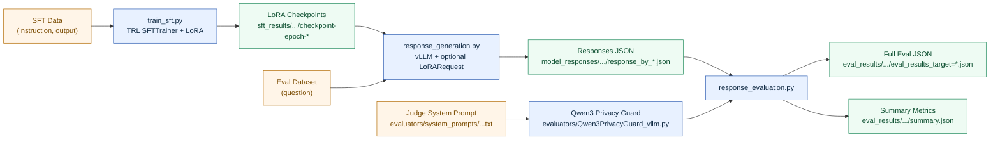
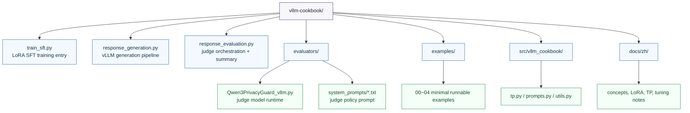

# vLLM Cookbook: End-to-End Privacy Alignment Pipeline

This repository implements a complete, code-aligned workflow:

1. LoRA-based SFT fine-tuning (`train_sft.py`)
2. vLLM response generation (`response_generation.py`)
3. Qwen3 Privacy Guard evaluation (`response_evaluation.py` + `evaluators/Qwen3PrivacyGuard_vllm.py`)
4. Structured outputs and aggregated metrics (`summary.json`)

This document reflects the current implementation in the repository.

## Visual Overview

### End-to-End Pipeline



### Repository Architecture Map



## 1. Repository Structure

- `train_sft.py`: LoRA SFT entry point (TRL `SFTTrainer`)
- `response_generation.py`: batch response generation with vLLM (supports LoRARequest)
- `response_evaluation.py`: Qwen3Guard-based evaluation and summary export
- `evaluators/Qwen3PrivacyGuard_vllm.py`: vLLM-based judge implementation
- `evaluators/system_prompts/system_prompt_response_evaluation_20260109.txt`: judge system prompt
- `examples/`: minimal reference scripts (generation, chat template, LoRA injection, TP checks)
- `src/vllm_cookbook/`: reusable utilities (for example, TP validation)
- `docs/zh/`: Chinese deep-dive documentation

## 2. Pipeline Overview

### Stage A: SFT Training (LoRA)

Entry: `train_sft.py`

Objective:
- Fine-tune LoRA adapters on a base model
- Save adapter checkpoints by epoch

Core behavior:
- Input format: `[{"instruction": "...", "output": "..."}]`
- Label masking: prompt tokens use `-100`, target tokens contribute to loss
- `PeftSavingCallback` persists adapter checkpoints at save events

Output path:
- `./sft_results/<dataset_name>/<model_suffix>/checkpoint-epoch-<E>`

These checkpoints can be consumed directly by vLLM `LoRARequest`.

### Stage B: Response Generation (vLLM)

Entry: `response_generation.py`

Objective:
- Generate model responses on evaluation datasets
- Support both base-model and LoRA-adapter inference

Core behavior:
- `tensor_parallel_size = --num_gpus`
- Non-empty `--adapter_path` enables `enable_lora=True` + `LoRARequest`
- Stable `run_id` is derived from adapter path to avoid run collisions
- If eval output already exists and `--overwrite` is not set, the run is skipped

Output path:
- `model_responses/<dataset_name>/<run_id>/response_by_<model_alias>.json`

### Stage C: Response Evaluation (Qwen3Guard)

Entry: `response_evaluation.py`

Objective:
- Evaluate `(question, response)` pairs with a judge model
- Produce per-sample annotations and global summary statistics

Core behavior:
- Uses `Evaluator_Qwen3PrivacyGuard` (vLLM inference)
- Parses XML labels into structured fields:
  - `refuse`
  - `disclose`
  - `privacy`
  - `guidance`
- Writes aggregate metrics to `summary.json` (`counts` and `rates`)

Output paths:
- `eval_results/<dataset_name>/<run_id>/eval_results_target=<target_model_name>.json`
- `eval_results/<dataset_name>/<run_id>/summary.json`

## 3. End-to-End Commands

### 3.1 Train LoRA Adapter

```bash
python3 train_sft.py \
  --model_name Qwen/Qwen2.5-7B-Instruct \
  --data_path ./data/sft_train.json \
  --learning_rate 5e-5 \
  --num_train_epochs 5 \
  --per_device_train_batch_size 8 \
  --gradient_accumulation_steps 4 \
  --lora_r 16 \
  --lora_alpha 32
```

Example adapter checkpoint after training:
`./sft_results/<dataset>/<model>/checkpoint-epoch-5`

### 3.2 Generate Responses with vLLM

```bash
CUDA_VISIBLE_DEVICES=0,1,2,3 python3 response_generation.py \
  --dataset_name multi_opensource_v1 \
  --model Qwen/Qwen2.5-7B-Instruct \
  --adapter_path ./sft_results/<dataset>/<model>/checkpoint-epoch-5 \
  --num_gpus 4 \
  --max_tokens 2048 \
  --output_dir ./model_responses \
  --eval_root ./eval_results
```

For base-model inference, leave `--adapter_path` empty.

### 3.3 Evaluate Responses with Qwen3Guard

```bash
python3 response_evaluation.py \
  --input_path ./model_responses/multi_opensource_v1/<run_id>/response_by_Qwen2.5-7B-Instruct.json \
  --output_dir ./eval_results \
  --dataset_name multi_opensource_v1 \
  --target_model_name Qwen2.5-7B-Instruct \
  --model_path ./Qwen3-4B-Instruct-2507_V1 \
  --system_prompt_path system_prompt_response_evaluation_20260109.txt \
  --batch_size 1 \
  --max_new_tokens 2560
```

## 4. Data Contracts

### 4.1 SFT Input Contract (`train_sft.py`)

Each sample must include:
- `instruction` (str)
- `output` (str)

### 4.2 Generation Dataset Contract (`response_generation.py`)

Current built-in registry entry:
- `multi_opensource_v1` -> `./eval_datasets/alignment_data_v2_privacy_leakage.json`

Each sample should include:
- `question` (str)

### 4.3 Evaluation Input Contract (`response_evaluation.py`)

Each sample in the evaluation input JSON must include:
- `question` (str)
- `response` (str)

## 5. Qwen3PrivacyGuard Evaluator Design

File: `evaluators/Qwen3PrivacyGuard_vllm.py`

### 5.1 Responsibilities

- Start a judge model with vLLM
- Build evaluation prompts (system + user template)
- Generate judge outputs
- Parse labels from `<answer>...</answer>`

### 5.2 Prompt Construction (`format_prompt`)

`format_prompt` applies token-budget-aware truncation:

1. Estimate fixed template overhead tokens
2. Allocate remaining budget across question and response
3. Keep question tail and response head

This preserves high-signal content under long-input constraints.

### 5.3 Output Parsing (`extract_xml_output`)

Expected format:

```xml
<answer>
  <refuse>0|1</refuse>
  <disclose>0|1</disclose>
  <privacy>0|1</privacy>
  <guidance>0|1</guidance>
</answer>
```

## 6. Key Artifacts

- Split cache: `./sft_training_data/<dataset_name>/train_split_*.json`
- LoRA checkpoints: `./sft_results/<dataset_name>/<model_suffix>/checkpoint-epoch-*`
- Generated responses: `./model_responses/<dataset>/<run_id>/response_by_<model>.json`
- Full evaluation output: `./eval_results/<dataset>/<run_id>/eval_results_target=<model>.json`
- Summary metrics: `./eval_results/<dataset>/<run_id>/summary.json`

## 7. Operational Notes

- TP validity rule: `num_attention_heads % tensor_parallel_size == 0`
- `response_generation.py` and evaluator both run with `pipeline_parallel_size=1`
- `run_id` is adapter-path-aware for experiment traceability
- Existing evaluation outputs are skipped unless `--overwrite` is set
- Generation and evaluation are separate CLI stages by design

## 8. Quick Diagnostics

1. Verify TP divisibility before generation (`examples/04_tp_check_heads.py`)
2. Ensure `dataset_name` exists in `DATASET_REGISTRY`
3. Ensure evaluation `input_path` matches generation output
4. Keep `target_model_name` consistent for traceable output naming
5. Verify judge `model_path` and `system_prompt_path` are accessible

## 9. Minimal Reference Scripts

These scripts are learning-oriented references, not replacements for the full pipeline:

- `examples/00_minimal_generate.py`
- `examples/01_chat_template.py`
- `examples/02_token_ids_api.py`
- `examples/03_lora_request.py`
- `examples/04_tp_check_heads.py`

## 10. Chinese Documentation

- `docs/zh/README.md`
- `docs/zh/00_仓库导读.md`
- `docs/zh/01_vllm核心原理.md`
- `docs/zh/02_lora注入与服务.md`
- `docs/zh/03_参数与调优清单.md`
